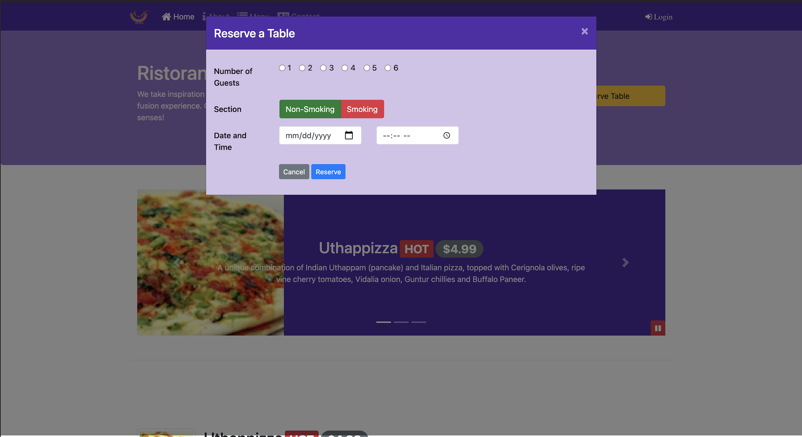

# Full-Stack-Web-Development-with-React
The Hong Kong University of Science and Technology on Coursera
- Front-End Web UI Frameworks and Tools: Bootstrap 4  &#x1F34E; _Done_
- Front-End Web Development with React: React &#x1F34F; _In Progress_
- Multiplatform Mobile App Development with React Native
- Server-side Development with NodeJS, Express and MongoDB

## First section
Front-End Web UI Frameworks and Tools: Bootstrap 4
- Preprocess CSS: Command with less convert to css: "lessc styles.less styles.css"
- Final index.html below:

## Second section
If you get an error when you are installing reactstrap, you can use this command "npm install reactstrap --legacy-peer-deps" to install again.
